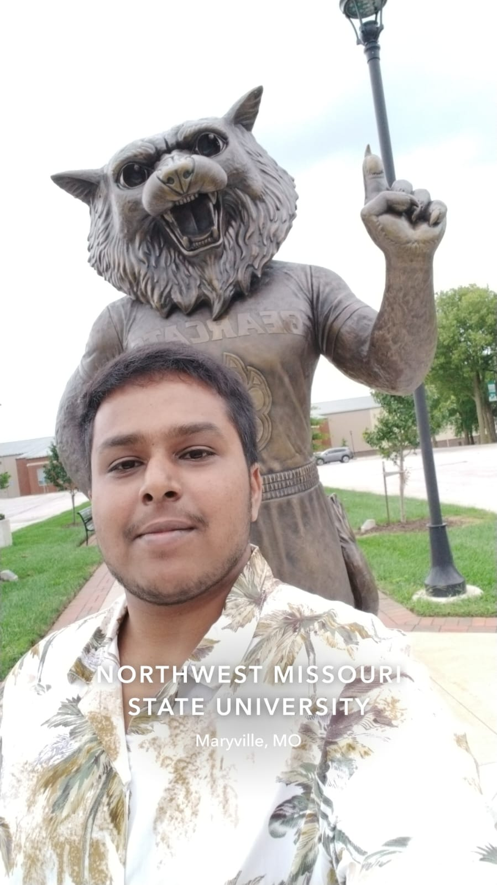

# Sunnith Reddy Kondam

Lesser known facts about me include I am a good chess player and has good understanding of hindu mythology and Indian history. Also, I was a volleyball player when in school.

---

### My views on sports and their significance

Below is the table that has my recommendation based on my liking and knowledge on sports :

|Name of the sport | Reason for recommendation | No of hrs/Week(Avg) |
| :---: | :---: | :---: |
|Volley ball| Has a good use of whole body, so keeps you fit | 3 hrs |
| basket ball | Makes you work in a team | 4 hrs |
| Chess | Mental sport, makes you calm and focused. | 6 hrs |
| Swimming | Water sport, good for health and is a life skill. | 4 hrs |

---

### My favourite quotations by scientists

>  *“Now I am become Death, the destroyer of worlds."*
> - *J. Robert Oppenheimer*

> *“Science is not just a subject, it’s a way of thinking.”*
> - *C.V. Raman*